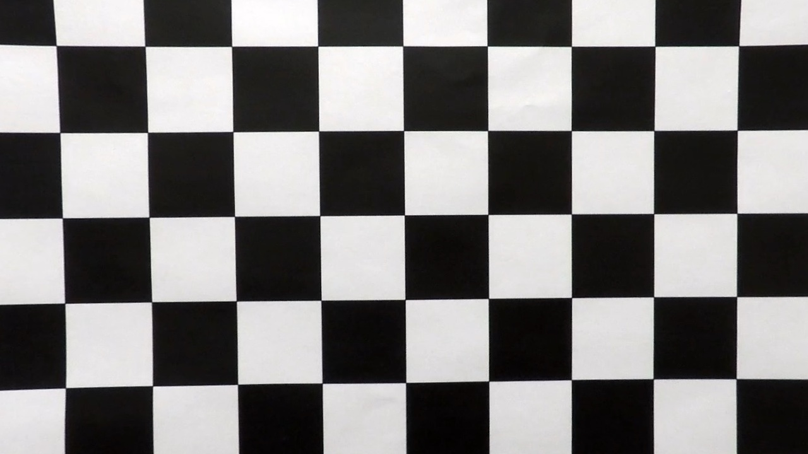
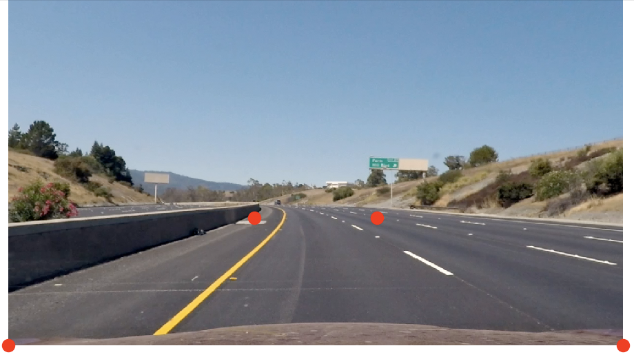
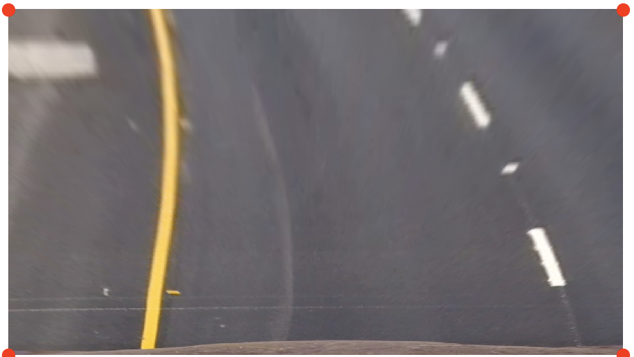
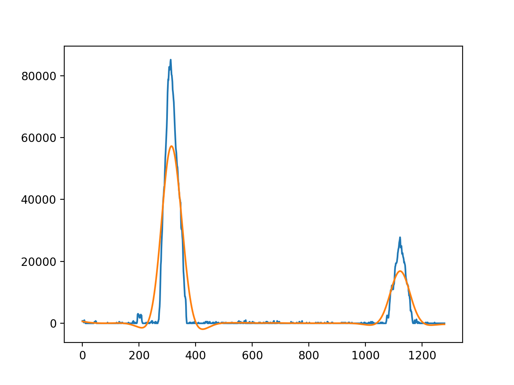
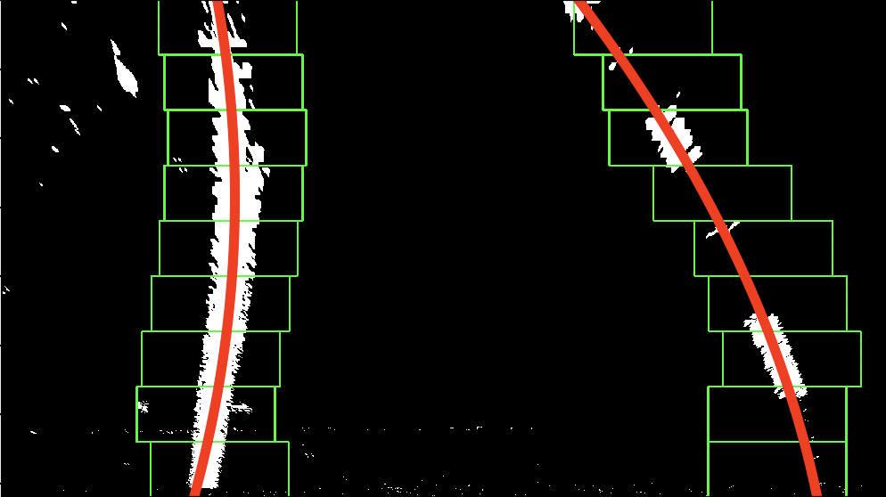
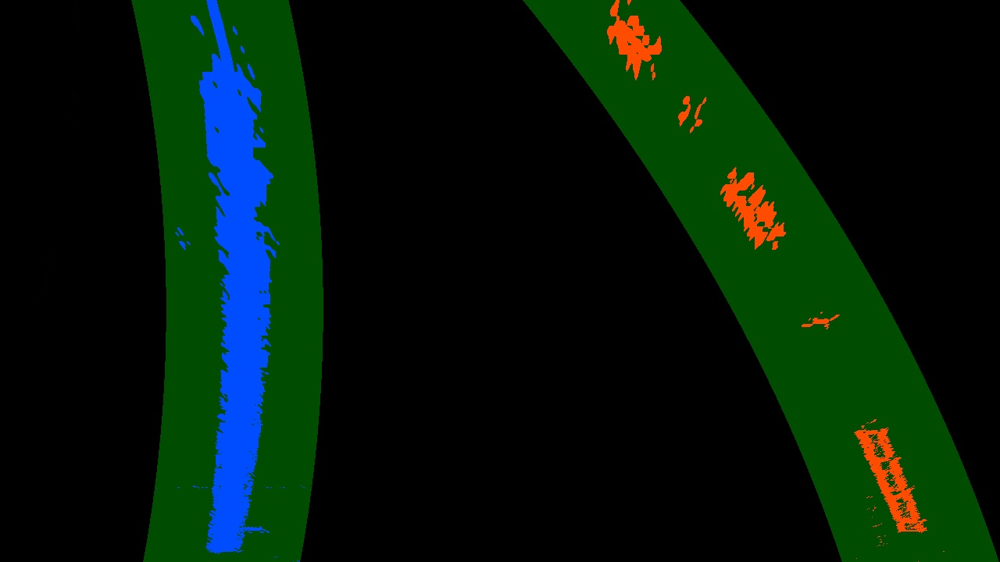
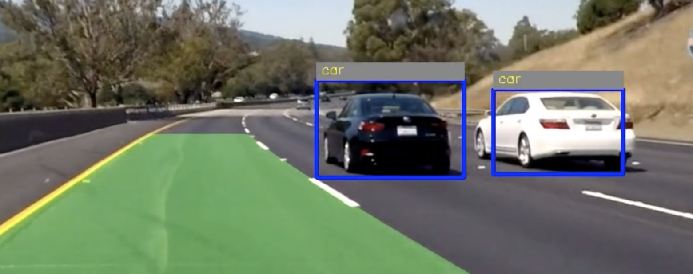

## Project: Advanced Lane Finding

In this project, I was tasked with using more practical OpenCV techniques for lane line detection. An entire pipeline was built 
to process each frame individually. I also used YOLO vehicle detection (pretrained model) in order to make a basic detection of the
vehicles surrounding the Self-driving car. 

### Lane Detection Pipeline Overview:

The following is a visual representation of the lane detection pipeline:

<center>
    
</center>

### Detailed Procedure:

#### Camera Calibration:

Through specific OpenCV functions, a set of chessboard images were used to discover corners and calibrate the camera for all images. 

The following is the result of undistorting one of the chessboard images: 

distorted image | undistorted image
:--------------:|:------------------:
| 

#### HSL Conversion and Gradient Combination:

1. The undistorted frame is converted to the HSL color space. 
2. The S and L channels are separated. 
3. A combined gradient is applied to each of these channels. 
4. Both channels are then combined. 

Note that the following parameters were using for the gradient threshold
```
Sobelx   -- Kernel size = 3, threshold = (50,  200)
Sobely   -- Kernel size = 3, threshold = (50,  200)
SobelMag -- Kernel size = 5, threshold = (20,  150)
SobelDir -- Kernel size = 5, threshold = (0.6, 1.1)
```

They are then combined in the following manner:

```
Sobelx == 1 and Sobely == 1 or SobelMag == 1 and SobelDir == 1
```

This combination gives the results that can be seen in the pipeline overview figure above. 

#### Perspective transform

At this stage, a bird's eye view is necessary in order to fit a 2D polynomial. The following vertices were selected in 
order to properly warp the image:
    
    ## Before
    src = np.float32([[0, img_height],
                      [0.4*img_width, 455],
                      [0.6*img_width, 455],
                      [img_width, img_height]])
                      
    ## After
    dst = np.float32([[0, img_height],
                      [0, 0],
                      [img_width, 0],
                      [img_width, img_height]])
                      
Here is a visual representation of these points and the transformation:

Original Image | Bird's eye view
:--------------:|:------------------:
| 

#### Color Masking:

While color masking is not a practical method to isolate lanes in noisey frames, it works well when combined with the 
Sobel gradient method. The color masking may improve and solidify the Sobel gradient combination. 

Basically, the yellow and white lanes were isolated and a mask was applied. The original undistorted image is first 
converted to HSV, then a perspective transform is applied to the image to get a bird's eye view, then the following 
values are used as thresholds for both lanes:

    white_hsv_low  = np.array([20,   0,  200])
    white_hsv_high = np.array([255,  80, 255])

    yellow_hsv_low  = np.array([0,  80,  200])
    yellow_hsv_high = np.array([40, 255, 255])
    
The color masking and combined Sobel warped images are combined with the bitwise_or function:

    final_transform = cv2.bitwise_or(stacked_pers_transform, color_masked_image_warped)[:, :, 0]
    
#### Sliding Windows and Looking Ahead:

After the above combination, the sliding windows method was applied to pinpoint the lanes. 

1. A histogram of the bottom half of the warped image is found and a low pass butterworth filter is applied. The 
following is the result: 

<p align="center">
    
</p>

2. The maximum peak before and after the midpoint are selected and assumed to be where the lanes begin. 
3. A window of margin 100 is run through the bases of those peaks and moves upwards, discovering lanes based on a 
threshold of pixels. The following becomes the result: 

<p align="center">
    
</p>

4. After that, in order to save time and stop the pipeline from blindly searching for the lanes on every frame, a look
ahead is implemented. This basically will take the values of the previous fit and continue forward. The following is 
a visual of the result:

<p align="center">
    
</p>

#### Radius of Curvature:

In order to find the vehicle's position, for each 2D polynomial, the first and second derivatives are calculated, and 
the Radius of Curvature for both lanes is found. Then, in order to calculate the vehicle's position, the center of the 
lanes is found by averaging both the left and right fitted polynomials, and then subtracting that center from half the 
frame's width. A conversion to meters is then made. 

#### Yolo Vehicle Detection: 

Additionally, I decided to implement some vehicle detection using a Yolo_pipeline from https://junshengfu.github.io/vehicle-detection/.
It was very much a plug and play and works well to a certain extent. 

<p align="center">
    
</p>

#### Final Result and videos:

    Main video:


<p align="center">
    
</p>

    Challenge video:

<p align="center">
    
</p>

    Harder Challenge video:

<p align="center">
    
</p>


#### Some Drawbacks: 

1. As the parameters regarding all the aspects of this setup are changed, and since this approach is done by example 
rather than generally, it is very difficult to create a highly accurate pipeline for all scenarios. A deep learning 
approach is required to do so. 

2. Even with the look ahead method, the model takes too long to learn compared to the live video feed. This is not 
practical when working on a live car. 

3. When the algorithm meets some sudden curves or more complicated transitions and lane changes, it does not transition 
well and sometimes even breaks (like in the harder_challenge_video).

#### File structure: 

- **lane_detect.py** contains the main lane detection pipeline. It also loads and processes the videos for lane and 
vehicle detection.
- **calibrate_camera.py** contains the class with the necessary functions to calibrate the camera and perform the 
perspective transform.
- **gradients.py** contains a class with all the functions related to color spaces and gradients.
- **helpers.py** Some miscellaneous functions necessary for projecting the results to video and saving the pipeline 
images. 
- **polynomial_fit.py** houses the necessary functions for the sliding window, look ahead technique and radius of 
curvature.
- **VehicleClassifier** contains all the files relating to the vehicle detection. 
- **output_images** contains the video results. 
