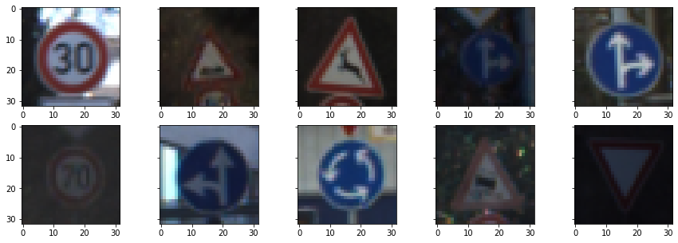
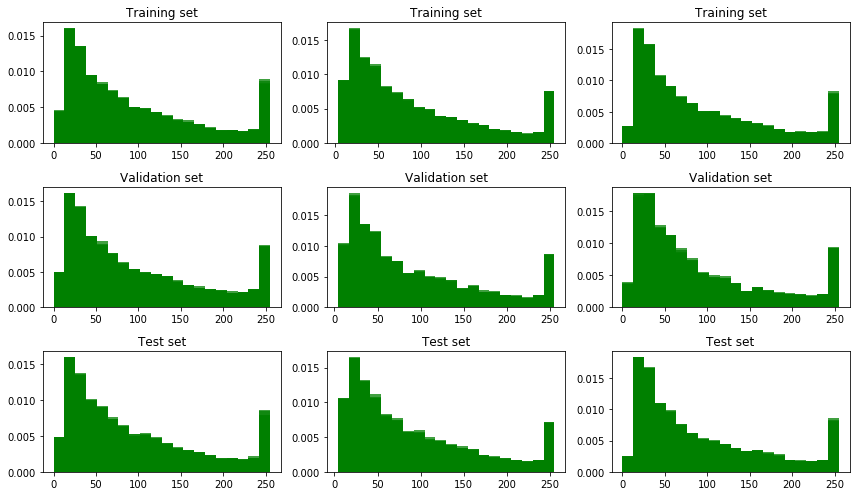
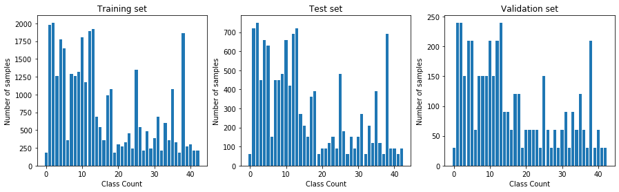
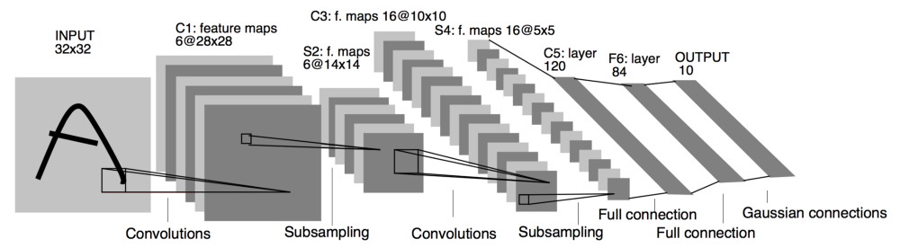
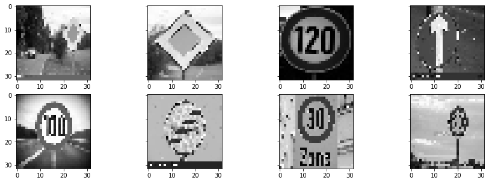
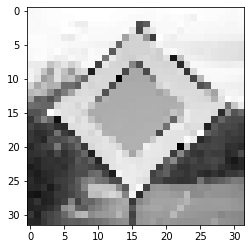
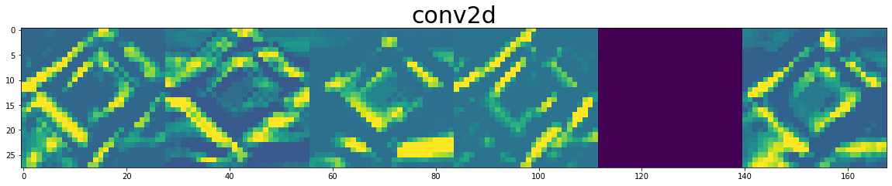
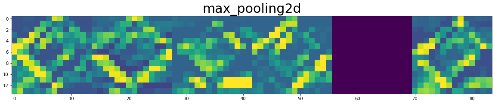
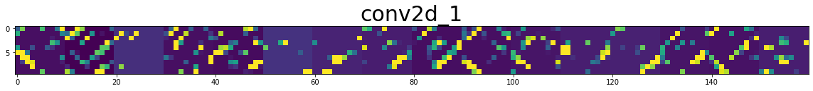
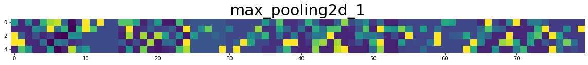

# Project 3: Traffic Sign Classifier

In this project,  neural networks were used to classify traffic signs from [German Traffic Sign Benchmarks](http://benchmark.ini.rub.de/?section=gtsrb&subsection=dataset). 

## Data Sample and Distributions:

The following is a preview of the data set. There are more than 50,000 lifelike images of  German traffic signs. 



The dataset is distributed evenly across both color and category. The following results could be seen. 

Distribution across Channel:



Distribution across Class:



### Model Architecture: LeNet 5



Using the LeNet 5 model yielded some decent results. It was adjusted for the use cases in the below code. 

```python
LeNet = tf.keras.Sequential([
    tf.keras.layers.Conv2D(filters=6, 
                           kernel_size=(5, 5), 
                           activation='relu', 
                           strides=(1, 1),
                           padding='valid',
                           input_shape=(32,32, 1)),
    tf.keras.layers.MaxPooling2D((2, 2)),
    tf.keras.layers.Conv2D(filters=16, 
                           kernel_size=(5, 5), 
                           activation='relu'),
    tf.keras.layers.MaxPooling2D((2, 2)),
    
    tf.keras.layers.Flatten(),
    tf.keras.layers.Dense(120, activation='relu'),
    tf.keras.layers.Dense(84, activation='relu'),
    tf.keras.layers.Dense(n_classes, activation='softmax')
])
```

### Training Results

The model was compiled and fitted in the following manner on the data. It was a relatively straigtforward model, and the results were quite decent. Even on the first try.  The validation accuracy was over 93%. 

```python
epochs = 10
batch_size = 32
optimizer = tf.keras.optimizers.Adam(learning_rate= 0.01, name='Adam')
loss_function = tf.keras.losses.sparse_categorical_crossentropy

LeNet.compile(optimizer='adam', loss= loss_function, metrics=['accuracy'])
history = LeNet.fit(
    x=X_train_norm, 
    y=y_train, 
    batch_size = batch_size, 
    epochs=epochs, 
    validation_data= (X_valid_norm, y_valid)
)
```

```latex
Epoch 1/10
1088/1088 [==============================] - 5s 5ms/step - loss: 0.0239 
- accuracy: 0.9930 - val_loss: 0.4545 - val_accuracy: 0.9295
Epoch 2/10
1088/1088 [==============================] - 5s 5ms/step - loss: 0.0265 
- accuracy: 0.9930 - val_loss: 0.3280 - val_accuracy: 0.9379
Epoch 3/10
1088/1088 [==============================] - 5s 5ms/step - loss: 0.0256 
- accuracy: 0.9928 - val_loss: 0.3236 - val_accuracy: 0.9385
Epoch 4/10
1088/1088 [==============================] - 5s 5ms/step - loss: 0.0183
- accuracy: 0.9948 - val_loss: 0.3992 - val_accuracy: 0.9283
Epoch 5/10
1088/1088 [==============================] - 5s 5ms/step - loss: 0.0172 
- accuracy: 0.9955 - val_loss: 0.5683 - val_accuracy: 0.9143
Epoch 6/10
1088/1088 [==============================] - 5s 5ms/step - loss: 0.0225 
- accuracy: 0.9936 - val_loss: 0.4050 - val_accuracy: 0.9379
Epoch 7/10
1088/1088 [==============================] - 5s 5ms/step - loss: 0.0164 
- accuracy: 0.9954 - val_loss: 0.4559 - val_accuracy: 0.9392
Epoch 8/10
1088/1088 [==============================] - 5s 5ms/step - loss: 0.0204 
- accuracy: 0.9943 - val_loss: 0.4192 - val_accuracy: 0.9363
Epoch 9/10
1088/1088 [==============================] - 5s 5ms/step - loss: 0.0138 
- accuracy: 0.9962 - val_loss: 0.4540 - val_accuracy: 0.9315
Epoch 10/10
1088/1088 [==============================] - 5s 5ms/step - loss: 0.0155 
- accuracy: 0.9956 - val_loss: 0.4618 - val_accuracy: 0.9236
```

The accuracy reported on the test set was 0.9138558986539984

### Extra Images:

The following were 8 extremely low quality examples to show that the model requires training on much more complicated data. Here is a plot of them after preprocessing and a slight enhancement. 



The accuracy reported here was somewhere around 0.125, which is obviously not great. It seems as if these images either require more preprocessing, or the training requires more varied data. 

### Feature Maps

Here is a visualization of how the model was extracting features from predicting the following image. 












