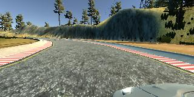
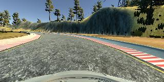
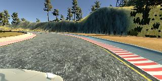

<h1 style="color: #3a87ad">Udacity Project 4 - Behavioral Cloning</h1>

<h2 style="color: #3a87ad">Introduction</h2>

In this project, I was tasked with teaching a Neural Network my own driving pattern in Udacity's simulator. The simulator 
collected images of my driving that I used to train and test several neural networks. I tried LeNet, InceptionV3 with 
some modifications and a model architecture outlined by nVidia in this 
<a href="https://developer.nvidia.com/blog/deep-learning-self-driving-cars/?ncid=afm-chs-44270&ranMID=44270&ranEAID=a1LgFw09t88&ranSiteID=a1LgFw09t88-eRZ5swEwc1zdTIYasZfm8A" target="_blank">
paper</a>. The nVidia network scored the highest, with an **r2 score = 0.64**, and result can be seen in the **track1_video.mp4** file. 

<h2 style="color: #3a87ad">Simulator, cameras and images</h2>

The simulator allowed the user to drive the car using specific steering controls with the mouse in order to capture the 
steering angle more accurately. Here is a sample of the simulator:

<center></center> 

<br>

With the following images representing the different camera angles, left, center and right respectively:

<center>



</center>
<br>
Which were combined in order to train the model to readjust its driving if it starts to approach failure or go off track.

<h2 style="color: #3a87ad">Preprocessing</h2>

First, the images and their respective training angles were collected, adding a correction 0.2 degrees to the included 
measurement taken from the simulator. The images were then flipped and their data was adjusted accordingly. This added
more samples to the training data without the need for more collection. 

Second, normalization and cropping layers were added to the model in order to normalize the data and crop the unnecessary 
and possibly misleading areas of the images. The layers took the following form:

```python
Lambda(lambda x: (x / 255.0) - 0.5, input_shape=(160, 320, 3)),
Cropping2D(cropping=((50, 20), (0, 0)), input_shape=(160, 320, 3)),
```

<h2 style="color: #3a87ad">nVidia Network</h2>

The following is the network architecture that was used for this project:

<center></center> 
<br>

I added an additional Convolutional layer to the network with a 3x3 kernel and 64 filters, as well as the preprocessing 
layers, which changed the architecture to the following:

```python
self.nvidia = Sequential([
    Lambda(lambda x: (x / 255.0) - 0.5, input_shape=(160, 320, 3)),
    Cropping2D(cropping=((50, 20), (0, 0)), input_shape=(160, 320, 3)),

    LayerNormalization(epsilon=0.001),

    Conv2D(filters=24, kernel_size=(5, 5), activation='relu', strides=(3, 3), padding='valid'),
    Conv2D(filters=36, kernel_size=(5, 5), activation='relu'),
    Conv2D(filters=48, kernel_size=(5, 5), activation='relu'),
    Conv2D(filters=64, kernel_size=(3, 3), activation='relu'),
    Conv2D(filters=64, kernel_size=(3, 3), activation='relu'),
    # Extra Layer
    Conv2D(filters=64, kernel_size=(3, 3), activation='relu'),

    Flatten(),

    Dense(1164, activation='relu'),
    Dense(100, activation='relu'),
    Dense(50, activation='relu'),
    Dense(10, activation='relu'),
    Dense(self.n_classes)

])
```

<h2 style="color: #3a87ad">Results</h2>

The results of this network on track 1 can be found in track1_video.mp4. It responded well to the track's turns and made 
minimal mistakes while navigating. Here is a link to the video as well.
    
<iframe width="560" height="315" src="https://www.youtube.com/embed/Lu4OtC9Xvm0" frameborder="0" allow="accelerometer; autoplay; clipboard-write; encrypted-media; gyroscope; picture-in-picture" allowfullscreen></iframe>
[](https://www.youtube.com/watch?v=Lu4OtC9Xvm0)


<h2 style="color: #3a87ad">File Structure and Usage</h2>

This repo is composed of the following essential files:

* **drive.py**
* **video.py**
* **model.py**
* **train_model.py**

All the model architectures are located in the **model.py** file, and in order to train the network, run the **train_model.py**
file and it will save an h5 file in the root directory. 

After training, run the **drive.py** file in the following way in order to connect the model to the simulator and 
record a run: 

```shell script
python drive.py model.h5 video_recording_folder
python video.py video_recording_folder
```

Details of the simulator can be found here: https://github.com/udacity/self-driving-car-sim
