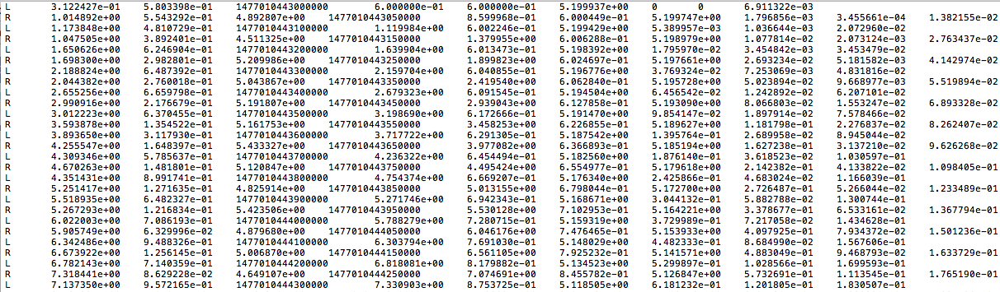
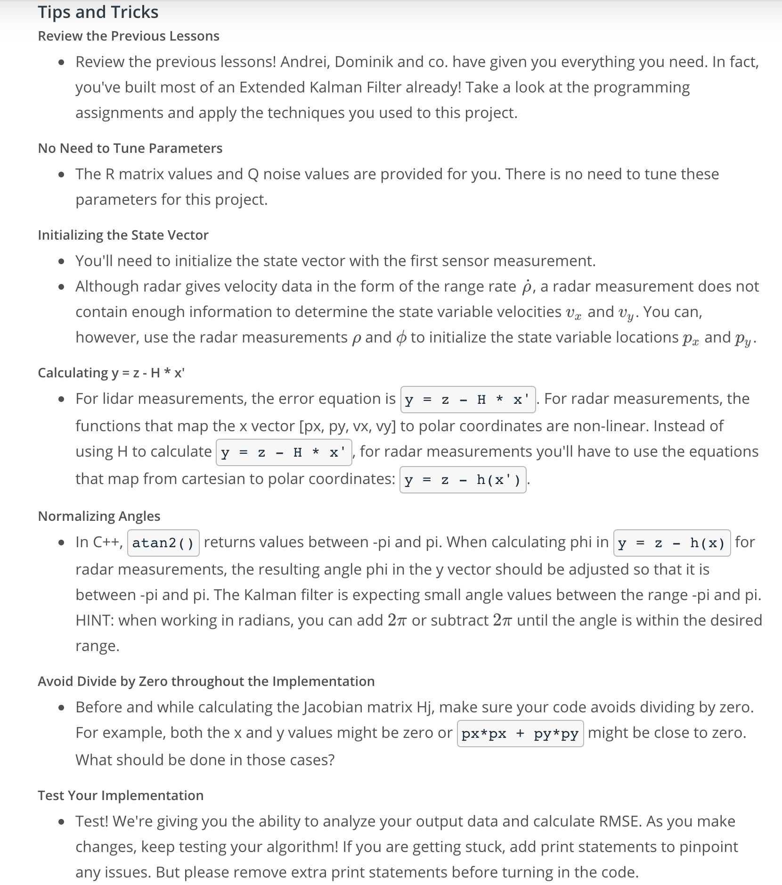

# Project Instructions

## Introduction 

Now that you have learned how the extended Kalman filter works, you are going to implement the extended Kalman filter in C++. We are providing simulated lidar and radar measurements detecting a bicycle that travels around your vehicle. You will use a Kalman filter, lidar measurements and radar measurements to track the bicycle's position and velocity.

The first step is to download the simulator, which contains all the projects for Self-Driving Car Nanodegree. More detailed instruction about setting up the simulator with uWebSocketIO can be found at the end of this section.

Lidar measurements are red circles, radar measurements are blue circles with an arrow pointing in the direction of the observed angle, and estimation markers are green triangles. The video below shows what the simulator looks like when a c++ script is using its Kalman filter to track the object. The simulator provides the script the measured data (either lidar or radar), and the script feeds back the measured estimation marker, and RMSE values from its Kalman filter.

## Explanation of the Data File

The github repo contains one data file:

obj_pose-laser-radar-synthetic-input.txt
Here is a screenshot of the first data file:

The simulator will be using this data file, and feed main.cpp values from it one line at a time.

<center>
    
</center>
Screenshot of Data File

Each row represents a sensor measurement where the first column tells you if the measurement comes from radar (R) or lidar (L).

For a row containing radar data, the columns are: sensor_type, rho_measured, phi_measured, rhodot_measured, timestamp, x_groundtruth, y_groundtruth, vx_groundtruth, vy_groundtruth, yaw_groundtruth, yawrate_groundtruth.

For a row containing lidar data, the columns are: sensor_type, x_measured, y_measured, timestamp, x_groundtruth, y_groundtruth, vx_groundtruth, vy_groundtruth, yaw_groundtruth, yawrate_groundtruth.

Whereas radar has three measurements (rho, phi, rhodot), lidar has two measurements (x, y).

You will use the measurement values and timestamp in your Kalman filter algorithm. Groundtruth, which represents the actual path the bicycle took, is for calculating root mean squared error.

You do not need to worry about yaw and yaw rate ground truth values.

Reading in the Data
We have provided code that will read in and parse the data files for you. This code is in the main.cpp file. The main.cpp file creates instances of a MeasurementPackage.

If you look inside 'main.cpp', you will see code like:
```c++
MeasurementPackage meas_package;
meas_package.sensor_type_ = MeasurementPackage::LASER;
meas_package.raw_measurements_ = VectorXd(2);
meas_package.raw_measurements_ << px, py;
meas_package.timestamp_ = timestamp;
```
and
```c++
vector<VectorXd> ground_truth;
VectorXd gt_values(4);
gt_values(0) = x_gt;
gt_values(1) = y_gt; 
gt_values(2) = vx_gt;
gt_values(3) = vy_gt;
ground_truth.push_back(gt_values);
```
The code reads in the data file line by line. The measurement data for each line gets pushed onto a measurement_pack_list. The ground truth [p_x, p_y, v_x, v_y][p 
x
​	 ,p 
y
​	 ,v 
x
​	 ,v 
y
​	 ] for each line in the data file gets pushed ontoground_truthso RMSE can be calculated later from tools.cpp.
​	 
​	 
​	 
## Overview of a Kalman Filter: Initialize, Predict, Update

To review what we learned in the extended Kalman filter lectures, let's discuss the three main steps for programming a Kalman filter:

* initializing Kalman filter variables
* predicting where our object is going to be after a time step Δt
* updating where our object is based on sensor measurements

Then the prediction and update steps repeat themselves in a loop.

To measure how well our Kalman filter performs, we will then calculate root mean squared error comparing the Kalman filter results with the provided ground truth.

These three steps (initialize, predict, update) plus calculating RMSE encapsulate the entire extended Kalman filter project.

## Files in the Github src Folder
The files you need to work with are in the src folder of the github repository.

1. main.cpp - communicates with the Term 2 Simulator receiving data measurements, calls a function to run the Kalman filter, calls a function to calculate RMSE
2. FusionEKF.cpp - initializes the filter, calls the predict function, calls the update function
3. kalman_filter.cpp- defines the predict function, the update function for lidar, and the update function for radar
4. tools.cpp- function to calculate RMSE and the Jacobian matrix

The only files you need to modify are FusionEKF.cpp, kalman_filter.cpp, and tools.cpp.

## How the Files Relate to Each Other
Here is a brief overview of what happens when you run the code files:

1. Main.cpp reads in the data and sends a sensor measurement to FusionEKF.cpp
2. FusionEKF.cpp takes the sensor data and initializes variables and updates variables. The Kalman filter equations are not in this file. FusionEKF.cpp has a variable called ekf_, which is an instance of a KalmanFilter class. The ekf_ will hold the matrix and vector values. You will also use the ekf_ instance to call the predict and update equations.
3. The KalmanFilter class is defined in kalman_filter.cpp and kalman_filter.h. You will only need to modify 'kalman_filter.cpp', which contains functions for the prediction and update steps.

## Main.cpp

Here we will discuss the main.cpp file. Although you will not need to modify this file, the project is easier to implement once you understand what the file is doing. As a suggestion, open the github repository for the project and look at the code files simultaneously with this lecture slide.

You do not need to modify the main.cpp, but let's discuss what the file does.

The Term 2 simulator is a client, and the c++ program software is a web server.

We already discussed how main.cpp reads in the sensor data. Recall that main.cpp reads in the sensor data line by line from the client and stores the data into a measurement object that it passes to the Kalman filter for processing. Also a ground truth list and an estimation list are used for tracking RMSE.

main.cpp is made up of several functions within main(), these all handle the uWebsocketIO communication between the simulator and it's self.

Here is the main protocol that main.cpp uses for uWebSocketIO in communicating with the simulator.

```c++
INPUT: values provided by the simulator to the c++ program

["sensor_measurement"] => the measurement that the simulator observed (either lidar or radar)


OUTPUT: values provided by the c++ program to the simulator

["estimate_x"] <= kalman filter estimated position x
["estimate_y"] <= kalman filter estimated position y
["rmse_x"]
["rmse_y"]
["rmse_vx"]
["rmse_vy"]
```

All the main code loops in h.onMessage(), to have access to intial variables that we created at the beginning of main(), we pass pointers as arguments into the header of h.onMessage().

For example:
```c++
h.onMessage([&fusionEKF,&tools,&estimations,&ground_truth]
            (uWS::WebSocket<uWS::SERVER> ws, char *data, size_t length, 
             uWS::OpCode opCode)
```

The rest of the arguments in h.onMessage are used to set up the server.

```c++
 // Create a Fusion EKF instance
  FusionEKF fusionEKF;

  // used to compute the RMSE later
  vector<VectorXd> estimations;
  vector<VectorXd> ground_truth;

  //Call the EKF-based fusion
  fusionEKF.ProcessMeasurement(meas_package); 
```

The code is:

* creating an instance of the FusionEKF class
* Receiving the measurement data calling the ProcessMeasurement() function. ProcessMeasurement() is responsible for the initialization of the Kalman filter as well as calling the prediction and update steps of the Kalman filter. You will be implementing the ProcessMeasurement() function in FusionEKF.cpp:

Finally,

The rest of main.cpp will output the following results to the simulator:

* estimation position
* calculated RMSE

main.cpp will call a function to calculate root mean squared error:

```c++
  // compute the accuracy (RMSE)
  Tools tools;
  cout << "Accuracy - RMSE:" << endl << tools.CalculateRMSE(estimations, ground_truth) << endl;
```

You will implement an RMSE function in the tools.cpp file.


Let's discuss the three files that you will need to modify.

## FusionEKF.cpp

In FusionEKF.cpp, we have given some starter code for implementing sensor fusion. In this file, you won't need to include the actual Kalman filter equations; instead, you will be initializing variables, initializing the Kalman filters, and then calling functions that implement the prediction step or update step. You will see TODO comments indicating where to put your code.

You will need to:

1. initialize variables and matrices (x, F, H_laser, H_jacobian, P, etc.)
2. initialize the Kalman filter position vector with the first sensor measurements
3. modify the F and Q matrices prior to the prediction step based on the elapsed time between measurements
4. call the update step for either the lidar or radar sensor measurement. Because the update step for lidar and radar are slightly different, there are different functions for updating lidar and radar.

### Initializing Variables in FusionEKF.cpp

```c++
  // initializing matrices
  R_laser_ = MatrixXd(2, 2);
  R_radar_ = MatrixXd(3, 3);
  H_laser_ = MatrixXd(2, 4);
  Hj_ = MatrixXd(3, 4);

  //measurement covariance matrix - laser
  R_laser_ << 0.0225, 0,
              0, 0.0225;

  //measurement covariance matrix - radar
  R_radar_ << 0.09, 0, 0,
              0, 0.0009, 0,
              0, 0, 0.09;

  /**
   * TODO: Finish initializing the FusionEKF.
   * TODO: Set the process and measurement noises
   */
```

Every time main.cpp calls fusionEKF.ProcessMeasurement(measurement_pack_list[k]), the code in FusionEKF.cpp will run. - If this is the first measurement, the Kalman filter will try to initialize the object's location with the sensor measurement.

### Initializing the Kalman Filter in FusionEKF.cpp
```c++
  /**
   * Initialization
   */
  if (!is_initialized_) {
    /**
     * TODO: Initialize the state ekf_.x_ with the first measurement.
     * TODO: Create the covariance matrix.
     * You'll need to convert radar from polar to cartesian coordinates.
     */

    // first measurement
    cout << "EKF: " << endl;
    ekf_.x_ = VectorXd(4);
    ekf_.x_ << 1, 1, 1, 1;

    if (measurement_pack.sensor_type_ == MeasurementPackage::RADAR) {
      // TODO: Convert radar from polar to cartesian coordinates 
      //         and initialize state.

    }
    else if (measurement_pack.sensor_type_ == MeasurementPackage::LASER) {
      // TODO: Initialize state.

    }

    // done initializing, no need to predict or update
    is_initialized_ = true;
    return;
  }
```

### Predict and Update Steps in FusionEKF.cpp
Once the Kalman filter gets initialized, the next iterations of the for loop will call the ProcessMeasurement() function to do the predict and update steps.

```c++
  /**
   * Prediction
   */

  /**
   * TODO: Update the state transition matrix F according to the new elapsed time.
   * Time is measured in seconds.
   * TODO: Update the process noise covariance matrix.
   * Use noise_ax = 9 and noise_ay = 9 for your Q matrix.
   */

  ekf_.Predict();

  /**
   * Update
   */

  /**
   * TODO: Use the sensor type to perform the update step.
   * TODO: Update the state and covariance matrices.
   */

  if (measurement_pack.sensor_type_ == MeasurementPackage::RADAR) {
    // TODO: Radar updates

  } else {
    // TODO: Laser updates

  }
```

In FusionEKF.cpp, you will see references to a variable called ekf_. The ekf_ variable is an instance of the KalmanFilter class. You will use ekf_ to store your Kalman filter variables (x, P, F, H, R, Q) and call the predict and update functions. Let's talk more about the KalmanFilter class.

## KalmanFilter Class

kalman_filter.h defines the KalmanFilter class containing the x vector as well as the P, F, Q, H and R matrices. The KalmanFilter class also contains functions for the prediction step as well as the Kalman filter update step (lidar) and extended Kalman filter update step (radar).

You will need to add your code to kalman_filter.cpp to implement the prediction and update equations. You do not need to modify 'kalman_filter.h'.

Because lidar uses linear equations, the update step will use the basic Kalman filter equations. On the other hand, radar uses non-linear equations, so the update step involves linearizing the equations with the Jacobian matrix. The Update function will use the standard Kalman filter equations. The UpdateEKF will use the extended Kalman filter equations:

```c++
void KalmanFilter::Predict() {
  /**
   * TODO: predict the state
   */
}

void KalmanFilter::Update(const VectorXd &z) {
  /**
   * TODO: update the state by using Kalman Filter equations
   */
}

void KalmanFilter::UpdateEKF(const VectorXd &z) {
  /**
   * TODO: update the state by using Extended Kalman Filter equations
   */
}
```

## Tools.cpp

This file is relatively straight forward. You will implement functions to calculate root mean squared error and the Jacobian matrix:

```c++
VectorXd Tools::CalculateRMSE(const vector<VectorXd> &estimations,
                              const vector<VectorXd> &ground_truth) {
  /**
   * TODO: Calculate the RMSE here.
   */
}

MatrixXd Tools::CalculateJacobian(const VectorXd& x_state) {
  /**
   * TODO: Calculate a Jacobian here.
   */
}
```
HINT: You implemented these already in the coding quizzes.

## Compiling and Running Your Code
Take a look at the github repo <a href="https://github.com/udacity/CarND-Extended-Kalman-Filter-Project/blob/master/README.md" target="_blank">README</a> file for instructions on how to compile and run your code.

## Summary of What Needs to Be Done

1. In tools.cpp, fill in the functions that calculate root mean squared error (RMSE) and the Jacobian matrix.
2. Fill in the code in FusionEKF.cpp. You'll need to initialize the Kalman Filter, prepare the Q and F matrices for the prediction step, and call the radar and lidar update functions.
3. In kalman_filter.cpp, fill out the Predict(), Update(), and UpdateEKF() functions.


<center>
    
</center>

### Ideas for Standing out!

The Kalman Filter general processing flow that you've learned in the preceding lessons gives you the basic knowledge needed to track an object. However, there are ways that you can make your algorithm more efficient!

* Dealing with the first frame, in particular, offers opportunities for improvement.
* Experiment and see how low your RMSE can go!
* Try removing radar or lidar data from the filter. Observe how your estimations change when running against a single sensor type! Do the results make sense given what you know about the nature of radar and lidar data?
* We give you starter code, but you are not required to use it! You may want to start from scratch if: You want a bigger challenge! You want to redesign the project architecture. There are many valid design patterns for approaching the Kalman Filter algorithm. Feel free to experiment and try your own! You want to use a different coding style, eg. functional programming. While C++ code naturally tends towards being object-oriented in nature, it's perfectly reasonable to attempt a functional approach. Give it a shot and maybe you can improve its efficiency!


## Resources for Completing the Project

The project's <a href = "https://github.com/udacity/CarND-Extended-Kalman-Filter-Project" target="_blank">
GitHub repository</a>
(included within the workspace) contains all of the files that you will need. The github repository includes:

* starter code in the src folder
* a README file with instructions on compiling the code
* a Docs folder, which contains details about the structure of the code templates
* CMakeLists.txt file that will be used when compiling your code (you do not need to change this file)
* a data file for testing your extended Kalman filter which the simulator interface provides

Here is a link to the <a href = "https://review.udacity.com/#!/rubrics/748/view" target = "_blank">
project rubric.</a> Your project will need to meet specifications for all of the criteria in the rubric.

## Dependencies

Keep in mind that the minimum project dependency versions are:

* cmake: 3.5
    * All OSes: <a href="https://cmake.org/install/" target="_blank">click here for installation instructions</a>
    
* make: 4.1 (Linux and Mac), 3.81 (Windows)
    * Linux: make is installed by default on most Linux distros
    * Mac: <a href="https://developer.apple.com/xcode/features/" target="_blank">install Xcode command line tools to get make</a>
    * Windows: <a href="http://gnuwin32.sourceforge.net/packages/make.htm" target="_blank">Click here for installation instructions</a>
    
* gcc/g++: 5.4
    * Linux: gcc / g++ is installed by default on most Linux distros
    * Mac: same deal as make - <a href="https://developer.apple.com/xcode/features/" target="_blank">install Xcode command line tools</a>
    * Windows: recommend using <a href="http://www.mingw.org/" target="_blank">MinGW</a>
    
## Optional Resources

To complete the project, you only need the files in the github repo; however, we are also providing some extra resources that you can use to develop your solution:

* A <a href="https://github.com/udacity/CarND-Mercedes-SF-Utilities" target="_blank">Sensor Fusion utilities repo</a> containing Matlab scripts that will generate more sample data (generating your own sample data is completely optional)

* A visualization package that you can also find within <a href="https://github.com/udacity/CarND-Mercedes-SF-Utilities" target="_blank">the Sensor Fusion utilities repo</a>

## Running the project in your local machine

1. Clone/fork the project's template files from <a href="https://github.com/udacity/CarND-Extended-Kalman-Filter-Project" target="_blank">the project repository</a>. (Note: Please do not submit your project as a pull request against our repo!)
2. Read the repo's <a href="https://github.com/udacity/CarND-Extended-Kalman-Filter-Project/blob/master/README.md" target="_blank">README</a> for more detailed instructions.
3. Clone the visualization and data generation utilities from the <a href="https://github.com/udacity/CarND-Mercedes-SF-Utilities" target="_blank">utilities repository</a>.
4. Build an Extended Kalman Filter by applying the general processing flow as described in the previous lessons.
5. Ensure that your project compiles.
    * From the root of the repo: 
        1. mkdir build && cd build
        2. cmake .. && make
        3. ./ExtendedKF
6. Test your code using the simulator!
7. Check your project against the <a href="https://review.udacity.com/#!/rubrics/748/view" target="_blank">project rubric</a>. Make sure your RMSE values satisfy the thresholds listed in the rubric!
8. Submit your project for review. Be sure to include all files necessary to compile and run your project, including the CMakeLists.txt file.

## Download Link for EKF Simulator
The EKF project was previously part of Term 2, so please download the <a href="https://github.com/udacity/self-driving-car-sim/releases/" target="_blank">Term 2 Simulator Release.</a>

## Running the Program

1. Download the simulator and open it. In the main menu screen select Project 1/2 EKF and UKF.

2. Once the scene is loaded you can hit the START button to observe how the object moves and how measurement markers are positioned in the data set. Also for more experimentation, "Data set 2" is included which is a reversed version of "Data set 1", also the second data set starts with a radar measurement where the first data set starts with a lidar measurement. At any time you can press the PAUSE button, to pause the scene or hit the RESTART button to reset the scene. Also, the ARROW KEYS can be used to move the camera around, and the top left ZOOM IN/OUT buttons can be used to focus the camera. Pressing the ESCAPE KEY returns to the simulator main menu.

3. The <a href="https://github.com/udacity/CarND-Extended-Kalman-Filter-Project" target="_blank">EKF project Github repository README</a> has more detailed instructions for installing and using c++ uWebScoketIO.

### NOTES:

* Currently hitting Restart or switching between data sets only refreshes the simulator state and not the Kalman Filter's saved results. The current procedure for refreshing the Kalman Filter is to close the connection, ctrl+c and reopen it, ./ExtendedKF. If you don't do this when trying to run a different data set or running the same data set multiple times in a row, the RMSE values will become large because of the previous different filter results still being observed in memory.
* The two functions in tools.cpp need to be implemented for the simulator to avoid throwing a segmentation fault - make sure to get those built out in order to test in the simulator!
* Students have reported rapid expansion of log files when using the term 2 simulator. This appears to be associated with not being connected to uWebSockets. If this does occur, please make sure you are connected to uWebSockets. The following workaround may also be effective at preventing large log files.

    * create an empty log file
    * remove write permissions so that the simulator can't write to log

## Project submission
Check your project against the project rubric. Make sure your RMSE values satisfy the thresholds listed in the rubric!

Once you are ready to submit go to the last item in this lesson and submit your project, make sure you include all the files necessary to compile and run your project!

## Problems with setup in your local machine?
Make sure to review the next lessons if you face any problem while preparing your local setup.

## Project Support
If you are stuck or having difficulties with the project, don't lose hope! Remember to talk to your mentors and fellow students in your Study Group, as well as ask (and answer!) questions on Knowledge tagged with the project name. We also have a previously recorded project Q&A that you can watch here!


