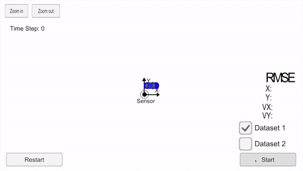

<h1 style="color: #3a7aad">Project 5 - Extendend Kalman Filters</h1>

<h2 style="color: #3a7aad">Introduction</h2>

Now that you have learned how the extended Kalman filter works, you are going to implement the extended Kalman filter 
in C++. We are providing simulated lidar and radar measurements detecting a bicycle that travels around your vehicle. 
You will use a Kalman filter, lidar measurements and radar measurements to track the bicycle's position and velocity.

<h2 style="color: #3a7aad">Simulator information</h2>

Lidar measurements are red circles, radar measurements are blue circles with an arrow pointing in the direction of the 
observed angle, and estimation markers are green triangles. The video below shows what the simulator looks like when a 
c++ script is using its Kalman filter to track the object. The simulator provides the script the measured data (either
 lidar or radar), and the script feeds back the measured estimation marker, and RMSE values from its Kalman filter.
 
<h2 style="color: #3a7aad">File Structure</h2>

The code files are located in source, and the relevant code files are located in 
`CarND-Extended-Kalman-Filter-Project-master/src`. They are: 

1. **FusionEKF.cpp**, where the sensor fusion is occurring. 
2. **kalman_filter.cpp**, where the Kalman Filter functions are defined. 
3. **tools.cpp**, where the RMSE and Jacobian Matrix are being calculated.

In order to compile and run the code, one must download the term2_simulator offered by Udacity and follow these steps: 

```shell script
mkdir build && cd build
cmake .. && make 
./ExtendedKF
```

<h2 style="color: #3a7aad">Results</h2>

The following run was observed, satisfying the rmse < [0.11, 0.11, 0.52, 0.52] threshold. 

<center>
    
</center>

