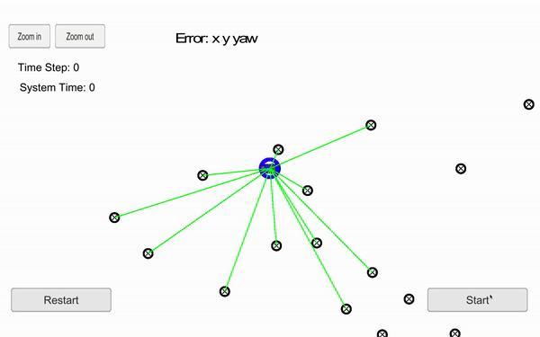

<h1 style="color: #3a7aad">Project 6 - Kidnapped Vehicle</h1>

In this project, a 2 dimensional particle filter was implemented in C++. The particle filter is given a map 
and some initial localization information (analogous to what a GPS would provide). At each time step the filter 
also gets observation and control data.

<h2 style="color: #3a7aad">Simulator</h2>


Included in the <a href="https://github.com/udacity/CarND-Kidnapped-Vehicle-Project">Kidnapped Vehicle project Github 
repository</a> are program files that allow you to set up and run c++ uWebSocketIO, which is used to communicate with 
the simulator. The simulator provides the script for the noisy position data, vehicle controls, and noisy observations. 
The script feeds back the best particle state.

The simulator can also display the best particle's sensed positions, along with the corresponding map ID associations. 
This can be extremely helpful to make sure transition and association calculations were done correctly. 

Simulator Download Link: https://github.com/udacity/self-driving-car-sim/releases

<h2 style="color: #3a7aad">File Structure</h2>

The code files are located in src, and the relevant code files are located in 
CarND-Kidnapped-Vehicle-Project-master/src. They are:

1. **particle_filter.cpp**
2. **particle_filter.h**
3. **map.h**
4. **json.hpp**
5. **helper_functions.h**
6. **main.cpp**

Only **particle_filter.cpp** required coding for this project, however the other files provided the required insight
in order to do so. 

In order to compile and run the code, one must download the term2_simulator offered by Udacity and follow these steps:

```shell script
./install-mac.sh
mkdir build && cd build
cmake .. && make 
./particle_filter
```

Alternatively, one can run: 

```shell script
./clean.sh
./build.sh
./run.sh
```

Then, run the simulator and hopefully the Particle filter will do its job!

<h2 style="color: #3a7aad">Results</h2>

Below is the result of the Particle Filter built for this project. 
 
Notice that the green laser sensors from the car nearly overlap the blue laser sensors from the particle, this means 
that the particle transition calculations were done correctly.

<center>
    
</center>