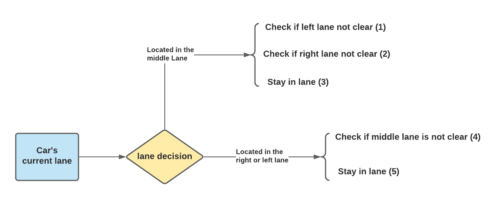

<h1 style="color: #3a7aad">Project 7: Path Planning and Highway Driving</h1>

The goal of this project was to build a path planner that creates smooth, safe trajectories for the car to follow. 
The highway track has other vehicles, all going different speeds and making lane changes, but approximately obeying 
the 50 MPH speed limit.

The car transmits its location, along with its sensor fusion data, which estimates the location of all the vehicles 
on the same side of the road. This data was considered when planning the vehicle's path. 

<h2 style="color: #3a7aad">Methodology and Cost Functions</h2>

The first step was to get the car to move on the right side of the road in the middle lane. The first step was to 
use the Fernet coordinates to generate a spline that allows the car to traverse within the lane lines along the road. 
The **spline.h** header file simplifies this process. 

The next step was to not hit any cars up ahead while traversing the middle lane. This was done by simply decelerating 
the vehicle without breaking the jerk or acceleration limits whenever a car was approximately 30 meters up ahead. 

<center>
    
</center>

The code that enforces this operation can be found in **main.cpp**, lines 104 - 127, and is sampled in this document 
as well. 

```c++
// looping over the sensor data of all the nearby vehicles
for(int i=0; i<sensor_fusion.size(); i++){
  float d = sensor_fusion[i][6];
  //checking if one of the nearby vehicle is in the same lane as the simulator car. 
  if(d < (2+4*lane+2) && d > (2+4*lane-2)){ 
      double vx = sensor_fusion[i][3];
      double vy = sensor_fusion[i][4];
      double check_speed = sqrt(vx*vx + vy*vy);
      double check_car_s = sensor_fusion[i][5];

      check_car_s += ((double)prev_size * 0.02 * check_speed);
      // If car is 30 meters ahead, it's too close!
      if((check_car_s > car_s) && (check_car_s - car_s < 30)){
          // ref_vel = 29.5;
          too_close = true;
          // Enforces lane changing, which will show up later
          lane = lane_changer(car_s, sensor_fusion, d, lane, prev_size);
      }

  }
}
// Decelerate steadily if the car is too close
if(too_close){
  ref_vel -= 0.224;
}
// Accelerate the car
else if(ref_vel < 49.5){
  ref_vel += 0.224;
}
```

At this stage the car was able to traverse along the middle lane without hitting any cars ahead. However, in order 
to further advance the vehicle forward, it was taught to make lane changes when appropriate. This process is summarized
in the following figure: 

<center>
 
</center>

A more detailed version of the conditions is as follows: 

(1) & (2) If the vehicle is in the middle lane, check if the left lane and right lane are not clear using the sensor fusion data.
```c++
-10 < potential_vehicle_s - project_vehicle_s < 30; //checked within the lane relevant d coordinates
```
If both lanes are not clear, the car will follow (3) and remain in the lane until another chance is discovered. 

(4) If the vehicle is not in the right or left lanes, and would like to lane change if a vehicle is blocking the 
way up ahead, then only the middle lane is searched for vehicles using sensor fusion data. If the middle lane is 
clear the project car will lane shift, otherwise it will remain in the lane. 

The relevant code for this process can be found in **helpers.h**, lines 167 - 234. The following is some pseudocode
of a fraction of the process that outlines the overall logic when scaled to all situations and lanes. 

```c++
int lane_changer(double car_s, vector<vector<double>> sensor_fusion, double d, int lane, int prev_size){
    bool car_in_lane = false;
    // If the simulator car is in the middle lane
    if(lane == 1) {
        //loop over sensor fusion data and make the necessary calculations to get 
        // the required s coordinate for the nearby vehicle. 
        //Then check if a vehicle is in the left lane
        if ((check_car_s - car_s < 30) && (check_car_s - car_s > -10)) {
            car_in_lane = true;
        }
        // loop over sensor fusion data ends
        if (car_in_lane) {
            // stay in lane
            return lane;
        }
        else{
            // Change lanes
            return 2;
        }           
    }
}
```

<h2 style="color: #3a7aad">File Structure</h2>

The following files are relevant to the programming of the simulator vehicle's path, and are located in src. 

1. **main.cpp** Contains the code that creates the car's spline and defines its path. 
2. **helpers.h** Contains the functions relevant to coordinate conversion, lane changing... etc. 
3. **spline.h** Houses the spline library used for trajectory generation. 

<h2 style="color: #3a7aad">Results</h2>

In summary, the vehicle moves forward, beginning in the middle lane, and when it meets a vehicle up ahead on the 
road, it begins to lane change (or attempt to do so). The following images outline the results. 

<br>

<p align="center">
 
 
</p>

