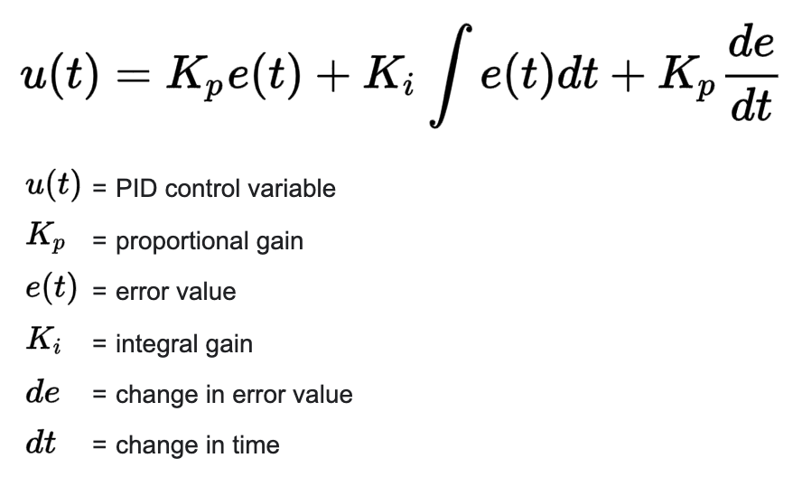

<h1 style="color: #3a7aad">Project 8 - PID Controller</h1>

In this project, the lake race track from the Behavioral Cloning Project was revisited. This time, however, a PID 
controller in C++ was implemented in order to maneuver the vehicle around the track.

The simulator provides the cross track error (CTE) and the velocity (mph) in order to compute the appropriate 
steering angle.

<h2 style="color: #3a7aad">PID Controller Formula in Relation to this Project</h2>

Firstly, the PID Controller formula is defined as follows. 

<p align="center">
    
</p>

In this case, the PID controller variable is the simulator vehicle's steering angle. The error value is the 
CTE. The integral is the sum of all previous CTEs over the time steps of the simulator. The change in error value 
is simply the previous CTE subtracted from the current time step's CTE. The change in time is also 1 (for every time step).

The coefficients `Kp`, `Ki` and `Kd` were tuned in the through the process outlined below. 

<h2 style="color: #3a7aad">Methodology and Parameter Tuning</h2>

In order to tune the PID model, a Twiddle function was built that commands the websocket, however, it was not completed
but gave some insight into the parameter changes. The final parameters were selected through brute force after that point. 

The parameters did work as expected. After running some experiments on each parameters individually and in selected 
combinations, a slightly large `Kp` and `Kd` would overshoot slightly, as studied in the classroom. Finally, 
the following values were selected. 

```c++
Kp = 0.15;
Ki = 0.00000000000000000001; //Enough to keep from overshooting
Kd = 2.5;
```

This selection of parameters performed well, and the results are outlined below. 

<h2 style="color: #3a7aad">File Structure</h2>

In order to run the project with the simulator, the following steps should be followed while in the 
CarND-PID-Control-Project-master directory. 

```shell script
mkdir build && cd build 
cmake .. && make 
./pid 
```

The files that contain the code for the project are located in src, and are composed of the following. 

1. **main.cpp** Contains the websocket that commands the simulator to move the vehicle. 
2. **PID.cpp** The class that houses the PID Controller formulas.
3. **PID.h** - Header file for the PID class.

<h2 style="color: #3a7aad">Results</h2>

The following was the result of the selected PID coefficients. 

<p align="center">
    <a href="http://www.youtube.com/watch?v=jKtPnZ0iBoU" target="_blank">
        
    </a>
</p>