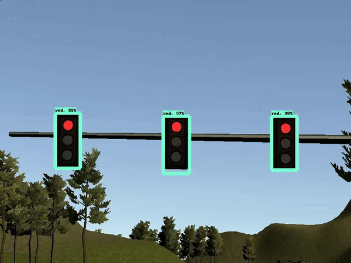

<h1 style="color:#3a7aad">Project 9 - Programming a Real Self-Driving Car</h1>

In this project, the idea was to integrate all the projects previously made 
into a full working system using ROS. It was actually built and set up to 
work on a an actual self-driving car, but is previewed on the following simulator. 

YouTube Link to result: https://youtu.be/3O-rvPbK-x0

<h2 style="color:#3a7aad">System Architecture</h2>

For this project, I wrote ROS nodes to implement the core functionality of the autonomous vehicle system, including traffic light detection, control, and waypoint following. The code was tested on a simulator and submitted to run on Carla, Udacity's self-driving car. 

The following is a system architecture diagram showing the ROS nodes and topics used in the project.

<h2 style="color:#3a7aad">Project Setup</h2>

Because ROS is used, you will need to use Ubuntu to develop and test your project code. You may use

* Ubuntu 14.04 with ROS Indigo
* Ubuntu 16.04 with ROS Kinetic

You are welcome to use your own Ubuntu installation or virtual machine (unsupported), or you can use the VM provided in Your Virtual Machine in the "Introduction to ROS" lesson. The provided VM has ROS and Dataspeed DBW installed already.

* Windows 10 users - your fellow students have suggested that the best local option is to use the VM for ROS, while running the simulator natively (and making sure to open ports between the two for communication).
* The project repo can be found here. Clone or download the project code before the next sections so you can follow along with the code descriptions! In the README, you should be able find any additional dependencies needed for the project.
* The system integration project uses its own simulator which will interface with your ROS code and has traffic light detection. It can be downloaded from Udacity's Capstone GitHub repo.

<h2 style="color:#3a7aad">Traffic Light Detection</h2>

The following are the visual results of the real-time traffic light detection model.

